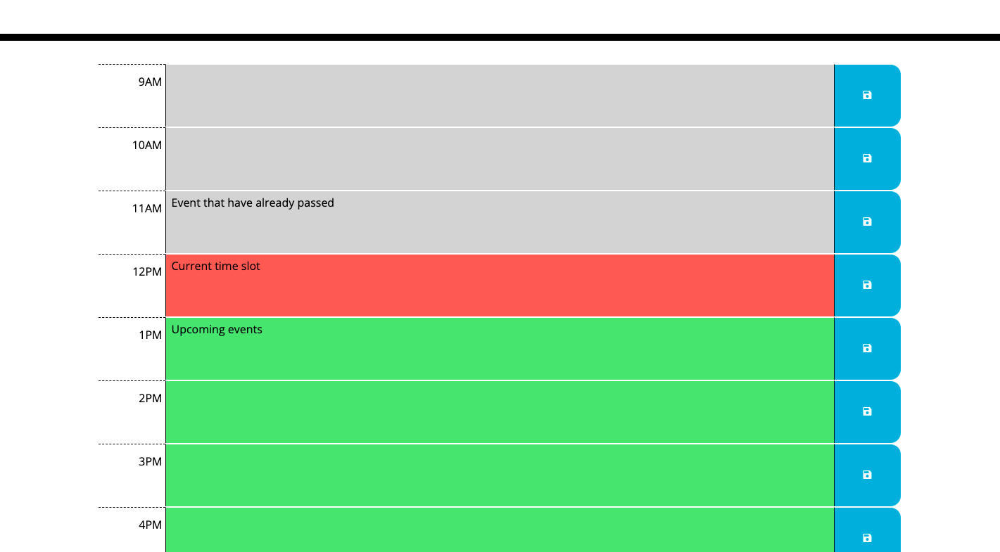
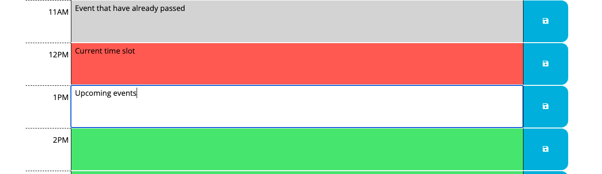
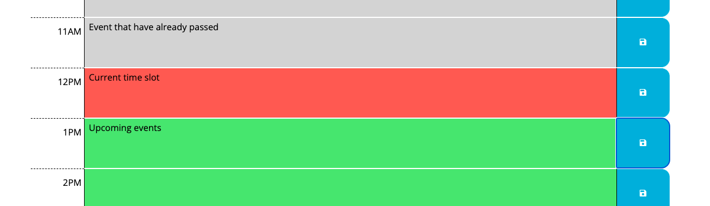
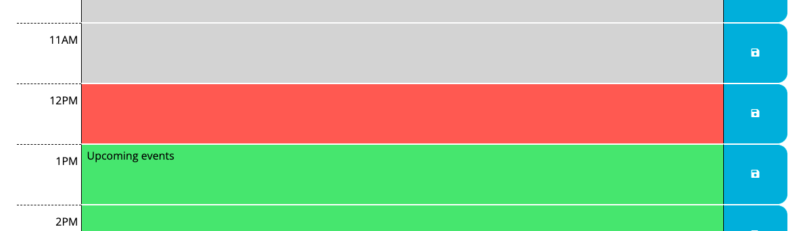
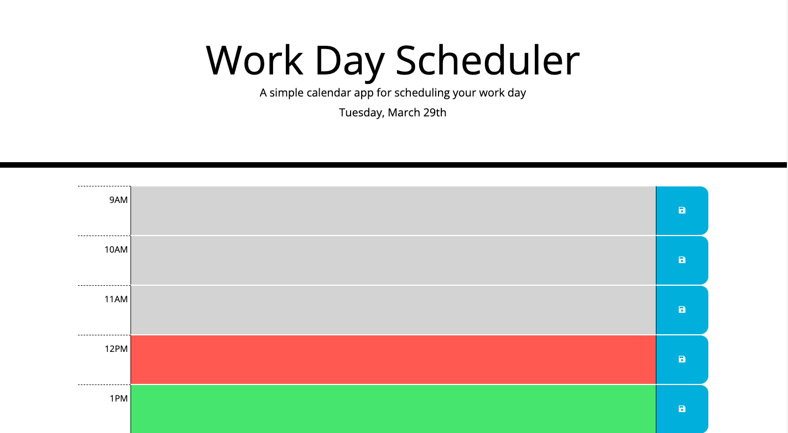

# Work-Day-Scheduler

# Purpose
This is a work day calendar to manage daily plans effectively. Easy to set and save events! Saved events will not be lost even after closing the app.

## Description
* The current day will be displayed at the top of the calendar.
* Below the current day, standard business hours time blocks are displayed to enter events and check your plan.
* Each time block is colored to indicate whether it is in the past, present, or future. The app will check the current time every 30 minutes. 
    
* Enter events by clicking the space next to the time. 
    
* Save the events to local storage by clicking the button next to the events you want to save. 
    
* The save events will persist after refreshing the page. 
    

## Built With
* HTML5
* CSS3
* Bootstrap
* jQuery
* REMIX ICON
* JavaScript

## Website
https://falconview.github.io/Work-Day-Scheduler/

## Contribution
Made Feroz Zargar
